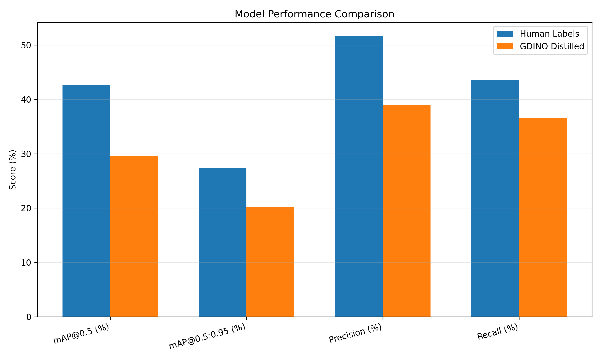

### Prerequisites

#### Convert OpenLogo dataset to YOLO format

```
uv run scripts/data_converter.py -s dataset/openlogo -o dataset/openlogo_yolo
```

#### Download GroundingDINO weights

[Grounding DINO SwinB Release](https://github.com/IDEA-Research/GroundingDINO/releases/tag/v0.1.0-alpha2)

```
mkdir -p GroundingDINO/weights
wget -P GroundingDINO/weights https://github.com/IDEA-Research/GroundingDINO/releases/download/v0.1.0-alpha2/groundingdino_swinb_cogcoor.pth
```

#### Generate Pseudo-Labels using GroundingDINO


```
cd GroundingDINO
```

##### Build GroundingDINO

[set CUDA_HOME](https://github.com/IDEA-Research/GroundingDINO?tab=readme-ov-file#hammer_and_wrench-install)

```
export CUDA_HOME=/usr/local/cuda  
uv pip install -e . --no-build-isolation
```

##### Run in test mode

```bash
uv run generate_gdino_labels.py \
  --config_file groundingdino/config/GroundingDINO_SwinB_cfg.py \
  --checkpoint_path weights/groundingdino_swinb_cogcoor.pth \
  --dataset_path ../dataset/openlogo_yolo \
  --output_path ../dataset/gdino_distill \
  --text_prompt "logo" \
  --box_threshold 0.25 \
  --text_threshold 0.2 \
  --min_size 0.001 \
  --max_size 0.8 \
  --max_aspect_ratio 5.0 \
  --test_mode \
  --test_samples 10
```
you can check the generated labels in `../dataset/gdino_distill/labels` and corresponding images in `../dataset/gdino_distill/visualizations`.

##### Remove test results
```
rm -r ../dataset/gdino_distill/labels
```

##### Generate pseudo-labels for the entire dataset

```bash
uv run generate_gdino_labels.py \
  --config_file groundingdino/config/GroundingDINO_SwinB_cfg.py \
  --checkpoint_path weights/groundingdino_swinb_cogcoor.pth \
  --dataset_path ../dataset/openlogo_yolo \
  --output_path ../dataset/gdino_distill \
  --text_prompt "logo" \
  --box_threshold 0.25 \
  --text_threshold 0.2 \
  --min_size 0.001 \
  --max_size 0.8 \
  --max_aspect_ratio 5.0
```

##### Create soft link for images
Make sure we will use the separate folder for distilled labels and images.

(go back to root folder)
```bash
cd ..
```

```bash
ln -s "$(pwd)/dataset/openlogo_yolo/images" dataset/gdino_distill/
```

### Train YOLOv8 with original labels

```bash
uv run scripts/train.py --human_labels
```

### Train YOLOv8 with distilled labels

```bash
uv run scripts/train.py --gdino_distill
```

### Convert to tflite

```bash
uv add "onnx>=1.14.0"

uv run scripts/convert_tflite.py -m ${PATH_TO_PT_MODEL}
```

### Model Comparison

Compare the two trained models (epoch 30) on the OpenLogo validation set:

```bash
uv run scripts/compare_models.py
```

#### Comparison Results

| Model           | mAP@0.5 (%) | mAP@0.5:0.95 (%) | Precision (%) | Recall (%) |
| :-------------- | ----------: | ---------------: | ------------: | ---------: |
| Human Labels    |       42.67 |            27.46 |         51.59 |      43.51 |
| GDINO Distilled |       29.57 |            20.26 |         38.97 |      36.50 |



**Key Observations:**
- The GDINO-distilled model achieves **69.3%** of the human-annotated model's mAP@0.5 (29.57% vs 42.67%)
- Distilled model reaches **73.8%** of human-labeled precision (38.97% vs 51.59%)
- Distilled model attains **83.9%** of human-labeled recall (36.50% vs 43.51%)
- The distilled model demonstrates reasonable performance considering it was trained entirely on pseudo-labels generated by GroundingDINO


### Flutter App
Put the two tflite models in `flutter_app/android/app/src/main/assets/` folder and set the file names as below:
```
ls flutter_app/android/app/src/main/assets/ 
dino-labels-yolov8.tflite  human-labels-yolov8.tflite
```

Run the flutter app
```
cd flutter_app
flutter run -d <device_id>
```